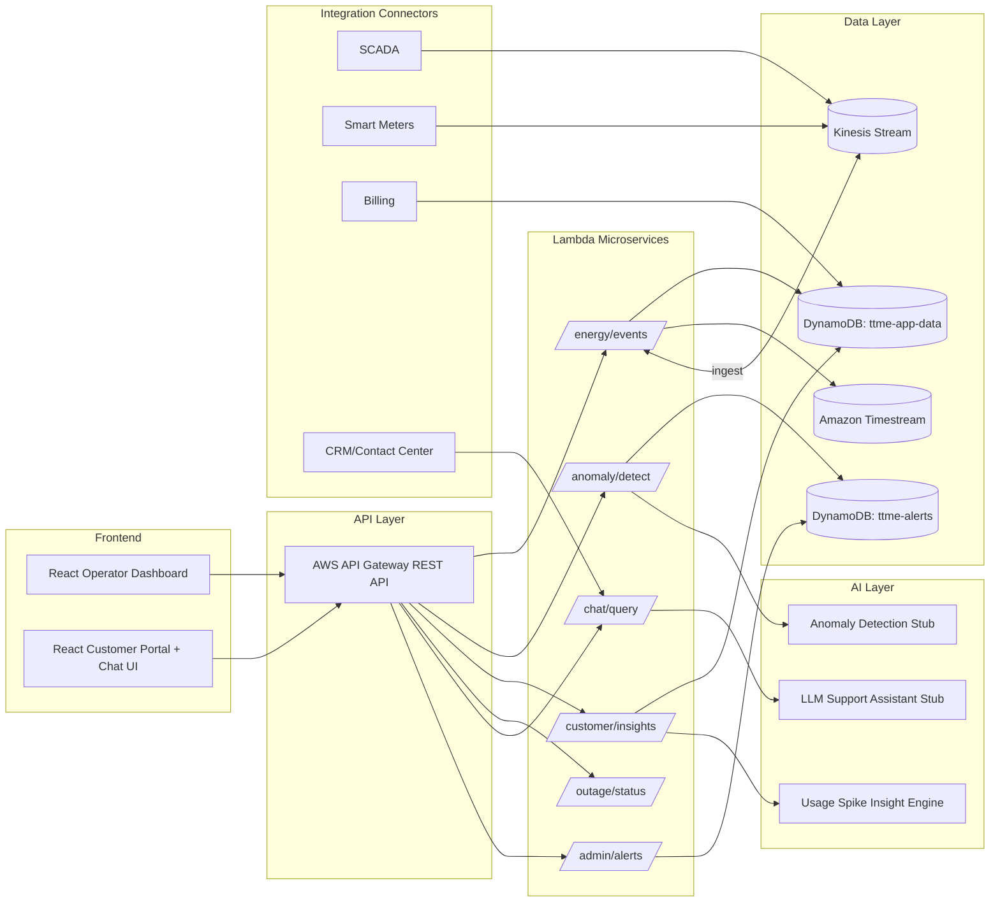

# TTME (TalkToMyEnergy) Prototype

Cloud-native starter platform for AI-powered utility operations and customer energy intelligence.

## 1) Architecture Diagram



## 2) Folder Structure

```text
.
├── backend/
│   ├── requirements.txt
│   └── src/
│       ├── handlers/
│       │   ├── admin_alerts.py
│       │   ├── anomaly_detect.py
│       │   ├── chat_query.py
│       │   ├── customer_insights.py
│       │   ├── energy_events.py
│       │   └── outage_status.py
│       ├── models/
│       │   └── anomaly_model.py
│       └── services/
│           ├── insight_service.py
│           └── response.py
├── frontend/
│   ├── package.json
│   ├── index.html
│   └── src/
│       ├── App.jsx
│       ├── components/
│       │   ├── atoms/
│       │   ├── molecules/
│       │   ├── organisms/
│       │   └── templates/
│       ├── data/dashboardData.js
│       ├── pages/CustomerPortal.jsx
│       ├── pages/OperatorDashboard.jsx
│       ├── main.jsx
│       └── styles.css
└── template.yaml
```

## 3) Infrastructure (AWS SAM)

- API Gateway REST API with routes:
  - `POST /energy/events`
  - `POST /anomaly/detect`
  - `GET /customer/insights`
  - `GET /outage/status`
  - `POST /chat/query`
  - `GET /admin/alerts`
- Lambda microservices in Python 3.11
- DynamoDB tables: `ttme-app-data`, `ttme-alerts`
- Amazon Timestream database/table for meter events
- Amazon Kinesis stream for smart meter + SCADA ingestion

See `template.yaml` for full IaC definition.

## 4) Backend Overview

- **Event ingestion**: `/energy/events` stores incoming smart meter/grid events
- **Anomaly detection**: `/anomaly/detect` runs a z-score based stub model and writes operator alerts
- **Customer insights**: `/customer/insights` returns bill spike explanation and recommendations
- **Outage status**: `/outage/status` gives restoration estimate payload
- **Chat query**: `/chat/query` returns TTME assistant response (LLM integration stub)
- **Admin alerts**: `/admin/alerts` lists alerts for operator dashboard

## 5) Frontend Overview

React + Vite dashboard with **Atomic Design hierarchy**:
- **Atoms**: `Card`, `SectionTitle`, `StatusPill`, `TextInput`, `PrimaryButton`
- **Molecules**: `AlertList`, `LoadStatusRow`, `ChatComposer`
- **Organisms**: `OperatorPanel`, `CustomerInsightsPanel`, `ChatbotPanel`
- **Template**: `DashboardLayout`
- **Pages**: `OperatorDashboard`, `CustomerPortal`

## 6) Deployment Instructions

### Prerequisites
- AWS CLI configured (`aws configure`)
- AWS SAM CLI installed
- Python 3.11+
- Node.js 18+

### Deploy backend

```bash
sam build
sam deploy --guided
```

After deploy, note the API URL output and wire it to your frontend API client.

### Run frontend locally

```bash
cd frontend
npm install
npm run dev
```

Open `http://localhost:5173`.

### Build and serve frontend

```bash
cd frontend
npm run build
npm run serve
```

Serve preview at `http://localhost:4173`.

### Example API calls

```bash
curl -X POST "$API_URL/energy/events" \
  -H "Content-Type: application/json" \
  -d '{"source":"smart_meter","meter_id":"M-1001","reading_kw":7.2,"event_type":"usage"}'

curl -X POST "$API_URL/anomaly/detect" \
  -H "Content-Type: application/json" \
  -d '{"location_id":"feeder-14","readings":[12.0,12.2,11.9,20.8]}'

curl "$API_URL/customer/insights?customer_id=C-221&weather=heatwave"
curl "$API_URL/outage/status?location_id=feeder-14"
curl "$API_URL/admin/alerts"
curl -X POST "$API_URL/chat/query" -H "Content-Type: application/json" -d '{"message":"Why is my bill higher?"}'
```

## Non-goals explicitly excluded
- No quote marketplace
- No ZIP lookup flows
- No lead generation features
